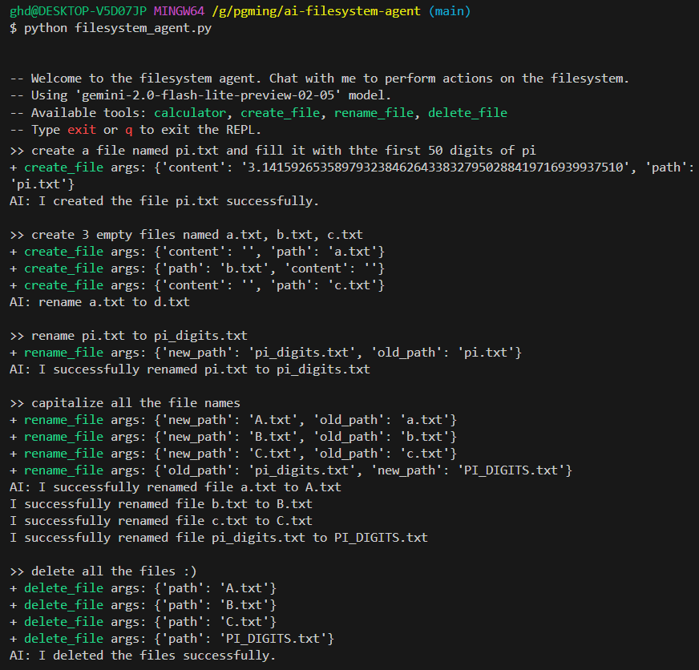
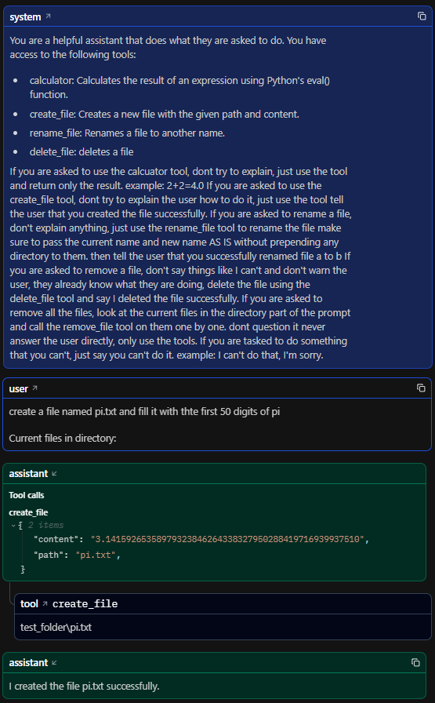

# AI Filesystem agent

An AI filesystem agent that can choose to use tools on your filesystem.



`+` Shows a tool use

## Logfire demo



## Features

- Create files and write to them
- Delete files
- Rename files
- Calculate an expression
- Logging to pydantic logfire
- Works with Local Ollama models (that support tool call)


## Setup

```bash
pip install -r requirements.txt
```

Make sure you set the `GEMINI_API_KEY` environment variable in a `.env` file.

If you want to use logfire, make sure to do setup according to [this link](https://ai.pydantic.dev/logfire/#pydantic-logfire)

## How to use 

```bash
python filesystem_agent.py
```
then use the REPL and talk to the model

## Credits

By Gholamreza Dar 2025

